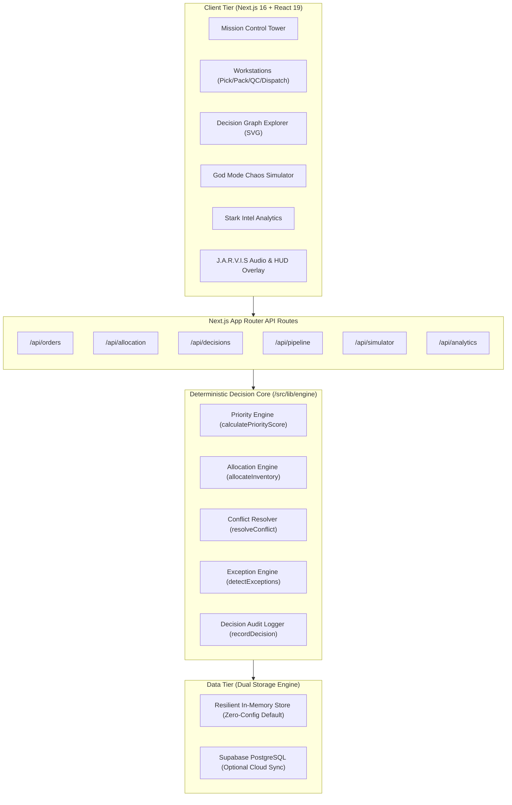

<<<<<<< HEAD
# ⚡ STARK INDUSTRIES WAREHOUSE — J.A.R.V.I.S WMS
=======
# STARK INDUSTRIES WAREHOUSE — J.A.R.V.I.S 
>>>>>>> origin/main

> **Autonomous Warehouse Decision Intelligence, Explainable Causal Graph & Real-Time Fulfillment Orchestration Platform**

[](https://stark-industries-warehouse.vercel.app/)
[](https://github.com/Immanuel-58/STARK-INDUSTRIES-WAREHOUSE)
[](https://github.com/Immanuel-58/STARK-INDUSTRIES-WAREHOUSE)
[](https://github.com/Immanuel-58/STARK-INDUSTRIES-WAREHOUSE)
[-black?style=for-the-badge&logo=next.js)](https://nextjs.org/)

---

<<<<<<< HEAD
## 📑 Table of Contents
=======
##⚡ System Overview
>>>>>>> origin/main

- [Executive Summary](#-executive-summary)
- [The Core Problem: Beyond Static Warehouse CRUD](#-the-core-problem-beyond-static-warehouse-crud)
- [System Highlights & Key Differentiators](#-system-highlights--key-differentiators)
- [Deep Dive: Deterministic Decision Engine](#-deep-dive-deterministic-decision-engine)
- [Deep Dive: J.A.R.V.I.S Explainable Decision Graph](#-deep-dive-jarvis-explainable-decision-graph)
- [Deep Dive: 4-Stage Operational Workstation Pipeline](#-deep-dive-4-stage-operational-workstation-pipeline)
- [Deep Dive: God Mode & What-If Chaos Simulator](#-deep-dive-god-mode--what-if-chaos-simulator)
- [Deep Dive: Stark Intel Analytics Dashboard](#-deep-dive-stark-intel-analytics-dashboard)
- [Industrial Ergonomics Meets Cinematic Theme](#-industrial-ergonomics-meets-cinematic-theme)
- [System Architecture & Data Flow](#-system-architecture--data-flow)
- [Complete API Layer Specification](#-complete-api-layer-specification)
- [Technology Stack](#-technology-stack)
- [Verified Testing & Quality Assurance](#-verified-testing--quality-assurance)
- [Quick Start & Local Setup](#-quick-start--local-setup)
- [Judge & Evaluator 3-Minute Guided Walkthrough](#-judge--evaluator-3-minute-guided-walkthrough)
- [Frequently Asked Questions (FAQ)](#-frequently-asked-questions-faq)
- [Future Engineering Roadmap](#-future-engineering-roadmap)
- [License & Attributions](#-license--attributions)

---

## 🌐 Live Access

- **Public Production Web App**: [https://stark-industries-warehouse.vercel.app/](https://stark-industries-warehouse.vercel.app/)
- **Public GitHub Codebase**: [https://github.com/Immanuel-58/STARK-INDUSTRIES-WAREHOUSE](https://github.com/Immanuel-58/STARK-INDUSTRIES-WAREHOUSE)
- **Zero-Authentication Demo**: Fully functional without login walls, API key configurations, or mandatory database setup.

---

## ⚡ Executive Summary

Modern supply chains fail not because of inventory shortages alone, but because of **decision latency, opaque prioritization, and static execution pipelines**. When hundreds of high-value, SLA-critical orders flood a fulfillment network simultaneously, conventional Warehouse Management Systems (WMS) freeze or require manual human triage.

**STARK INDUSTRIES WAREHOUSE (J.A.R.V.I.S WMS)** is an autonomous, high-throughput fulfillment orchestration system and decision engine. It replaces rigid CRUD inventory tables with:

1. **A Real-Time Deterministic Decision Engine** that scores and prioritizes orders across multi-variate SLA, customer tier, channel, and order value matrices.
2. **An Interactive Causal Decision Graph (SVG DAG)** that visually unpacks every routing, reservation, and exception decision down to its raw mathematical weights.
3. **An End-to-End 4-Station Workstation Pipeline** spanning Field Picking, Assembly Packing, Quality Inspection, and Dock Dispatch.
4. **An Operational "God Mode" Simulator** allowing supply chain engineers to inject chaos scenarios (demand surges, inventory damage, VIP rushes) and watch real-time autonomous re-allocation.
5. **A Cybernetic Tactical HUD** delivering micro-second telemetry, synthesized audio feedback (Web Audio API), presenter controls, and hotkey navigation.

---

## 🎯 The Core Problem: Beyond Static Warehouse CRUD

Most hackathon warehouse projects are **simple CRUD dashboards**—tables of products with basic "Add/Edit/Delete" forms and static pie charts. Real industrial warehousing is a dynamic, high-stakes distributed problem:

| Challenge | Traditional WMS / Hackathon CRUD | STARK INDUSTRIES J.A.R.V.I.S WMS |
| :--- | :--- | :--- |
| **Order Prioritization** | First-In-First-Out (FIFO) or manual sorting | Multi-factor polynomial priority scoring with exponential SLA decay curves |
| **Inventory Conflicts** | Race conditions; overselling or silent lockups | Deterministic multi-pool reservation with automatic shortage splitting & exception triggers |
| **Explainability** | Black-box status tags (`PENDING`, `PROCESSING`) | Full Causal DAG (Directed Acyclic Graph) showing exact scoring factors and allocation history |
| **Operational Pipeline** | Single status dropdown edit | Dedicated workstation interfaces for Picking, Packing, QC, and Dispatch with validation gates |
| **Resilience & Testing** | Static mocked data; breakable APIs | Interactive Chaos Simulator ("God Mode") + 60 automated unit tests + resilient in-memory fallback store |
| **User Experience** | Monotonous spreadsheet UI | Mission Control HUD with real-time telemetry, live ticker, sound FX, and presenter playbook |

---

## 💡 System Highlights & Key Differentiators

```
┌────────────────────────────────────────────────────────────────────────┐
│                   STARK INDUSTRIES MISSION CONTROL                     │
├──────────────────┬───────────────────┬─────────────────────────────────┤
│  DECISION ENGINE │  CAUSAL DAG GRAPH │  4-STAGE PIPELINE               │
│  • Multi-factor  │  • Node-link DAG  │  • Field Picking (Bin/Batch)    │
│  • SLA Curve     │  • Weight audits  │  • Assembly Packing (Tare Wt)   │
│  • Conflict Res. │  • Decision logs  │  • Suit QC (Quarantine Gate)    │
│  • Auto-reorder  │  • Interactive SVG│  • Launch Dispatch (Manifest)   │
├──────────────────┴───────────────────┴─────────────────────────────────┤
│  WHAT-IF GOD MODE SIMULATOR          STARK INTEL ANALYTICS             │
│  • Flash Demand Injections           • Bottleneck Station Heatmaps     │
│  • Inventory Spoilage / Damage       • SLA Compliance Velocity         │
│  • VIP Preemption Scenarios          • Throughput Trends (Recharts)    │
└────────────────────────────────────────────────────────────────────────┘
```

- **Zero Black Boxes**: Every single automated decision (why Order #104 got picked before Order #102) is backed by an inspectable causal event in the decision audit ledger.
- **Production Hardened**: 100% TypeScript strict mode, Zod runtime request validation, Turbopack compiled, and 60/60 passing Vitest unit tests.
- **Stateless Zero-Config Deployment**: Runs instantly on Vercel or local Node.js with built-in resilient in-memory data store, with optional Supabase PostgreSQL sync.

---

## 🧠 Deep Dive: Deterministic Decision Engine

At the core of STARK WMS lies a high-performance decision engine (`src/lib/engine/`) that processes inventory allocation, prioritizes order backlogs, resolves contention, and mitigates SLA breaches in under 5 milliseconds.

### 1. Multi-Factor Priority Scoring Formulation

The priority score $P \in [0, 100]$ is computed deterministically using weighted linear-polynomial synthesis:

$$P = \min\left(100, \max\left(0, w_{\text{sla}} S + w_{\text{val}} V + w_{\text{age}} A + w_{\text{tier}} T + w_{\text{chan}} C\right)\right)$$

Where default weights $\sum w_i = 1.0$:
- **$w_{\text{sla}} = 0.35$ (SLA Urgency)**: Uses quadratic urgency acceleration:
  $$S = \begin{cases} 100 & \text{if } h_{\text{rem}} \le 0 \\ 0 & \text{if } h_{\text{rem}} \ge 72 \\ \min\left(100, \left(\frac{72 - h_{\text{rem}}}{7.2}\right)^2\right) & \text{otherwise} \end{cases}$$
- **$w_{\text{val}} = 0.25$ (Order Value)**: Scaled against enterprise threshold ($V = \min(100, \frac{\text{value}}{10000} \times 100)$).
- **$w_{\text{age}} = 0.20$ (Backlog Age)**: Prevents starvation of smaller orders ($A = \min(100, \frac{\text{age\_hours}}{72} \times 100)$).
- **$w_{\text{tier}} = 0.10$ (Customer Tier)**: VIP ($100$), Premium ($70$), Standard ($40$).
- **$w_{\text{chan}} = 0.10$ (Channel Priority)**: Wholesale ($90$), Marketplace ($70$), Web ($60$), Mobile ($50$).

### 2. Contention & Conflict Resolution

When multiple orders request the same scarce inventory (e.g., Arc Reactor Cores or Vibranium Weave), the Decision Engine:
1. Sorts all pending allocation requests descending by computed priority score $P$.
2. Iterates through physical inventory pools (Aisle, Rack, Bin).
3. Executes atomic partial allocations when stock is constrained.
4. Generates automatic `PARTIAL_ALLOCATION` or `OUT_OF_STOCK` exception events.
5. Emits real-time reorder recommendations based on calculated reorder points ($S_{\text{eff}} = S_{\text{current}} - S_{\text{pending}}$).

---

## 🌳 Deep Dive: J.A.R.V.I.S Explainable Decision Graph

Traditional enterprise systems log opaque text entries. STARK INDUSTRIES WAREHOUSE features a custom-built, interactive **SVG Directed Acyclic Graph (DAG)** visualizer (`DecisionGraphExplorer.tsx`):

```
┌──────────────┐     ┌──────────────┐     ┌──────────────┐     ┌──────────────┐
│ Order Intake │ ──> │ Multi-Factor │ ──> │ Inventory    │ ──> │ Workstation  │
│ Order #104   │     │ Scoring (94) │     │ Allocation   │     │ Routing: QC  │
└──────────────┘     └──────────────┘     └──────────────┘     └──────────────┘
                            │                                         │
                            ▼                                         ▼
                     ┌──────────────┐                          ┌──────────────┐
                     │ SLA Penalty  │                          │ Launch Dock  │
                     │ Detected     │                          │ Dispatch #88 │
                     └──────────────┘                          └──────────────┘
```

### Key Graph Capabilities:
- **Interactive SVG Canvas**: Fluid zoom, pan, and node inspection.
- **Node Classification**: Distinguishes between Order Intake, Scoring Evaluations, Stock Pools, Workstation Routing, and Exception Handlers.
- **Causal Reasoning Path**: Click any node to highlight the exact upstream triggers and downstream consequences.
- **Decision Audit Ledger**: View raw inputs (exact customer tier, deadline delta, stock pool IDs) alongside human-readable explanations generated by J.A.R.V.I.S.

---

## 🚜 Deep Dive: 4-Stage Operational Workstation Pipeline

Orders move through physical warehouse fulfillment via four dedicated operational interfaces, each enforcing business rules and safety gates:

```
[ PENDING ] ──> [ FIELD PICKING ] ──> [ ASSEMBLY PACKING ] ──> [ SUIT QC ] ──> [ LAUNCH DISPATCH ] ──> [ COMPLETED ]
```

### 1. Field Deployment (Picking Station)
- **Location-Based Bin Routing**: Directs pickers to specific Zone, Aisle, Shelf, and Bin locations (e.g., `Zone A - Rack 04 - Bin B-12`).
- **Batch & Wave Picking**: Groups multi-order picks to minimize picker transit distance.
- **Lot / Batch Tracking**: Real-time item confirmation and shortage reporting.

### 2. Assembly Station (Packing Station)
- **Carton & Box Optimization**: Selects appropriate box sizes based on item cubic dimensions.
- **Tare & Gross Weight Verification**: Enforces scale validation to catch missing or extra items before sealing.
- **Containerization**: Generates packing slips, container labels, and barcoded manifests.

### 3. Suit Inspection (Quality Control Station)
- **Inspection Checklists**: Visual verification, dimensional check, and integrity testing.
- **Quarantine Workflow**: One-click quarantine isolation for damaged items with automated root-cause tagging.
- **Tolerance Verification**: High-precision threshold validation for high-value assets.

### 4. Launch Sequence (Dispatch Dock)
- **Carrier Routing & Allocation**: Integrates carrier selection (Stark Air Transport, Stark Logistics, Global Express).
- **Airway Bill & Tracking Generation**: Generates live tracking IDs and shipping labels.
- **Dock Door Assignment**: Routes packed cartons to designated loading docks (Dock Bay 1–4) for final carrier handoff.

---

## 🎮 Deep Dive: God Mode & What-If Chaos Simulator

The **God Mode Simulator** (`GodModeSimulator.tsx`) is a built-in sandbox for chaos engineering and scenario planning. Supply chain operators can stress-test the warehouse under extreme conditions:

- **🔥 Flash Demand Surge**: Injects 10–50 high-priority rush orders into the queue to test priority preemption.
- **💥 Inventory Spoilage / Damage**: Simulates sudden loss of inventory in specific bins and watches the engine automatically reallocate from secondary pools.
- **👑 VIP Order Preemption**: Injects a maximum-priority VIP order that overtakes standard orders in the picking queue.
- **🚚 Carrier Dock Bottleneck**: Simulates dock delays to evaluate buffer holding and SLA risk mitigation.
- **⚡ Real-Time Engine Reaction**: Zero page reloads required—the Decision Engine recalculates priorities, updates workstation queues, and redraws the Decision Graph live.

---

## 📊 Deep Dive: Stark Intel Analytics Dashboard

The **Stark Intel Analytics** module (`AnalyticsDashboard.tsx`) aggregates metrics across all pipeline stages using Recharts:

- **Throughput Velocity**: Units picked, packed, inspected, and dispatched per hour.
- **SLA Breach Risk Matrix**: Real-time radar of orders within 12h, 24h, and 48h of SLA expiration.
- **Station Bottleneck Heatmap**: Identifies dwell times at Picking, Packing, QC, and Dispatch to optimize labor allocation.
- **Exception Resolution Cycle Time**: Tracks mean time to resolve out-of-stock and damaged inventory exceptions.

---

## 🎨 Industrial Ergonomics Meets Cinematic Theme

While STARK INDUSTRIES WAREHOUSE features a distinct, immersive Iron Man / J.A.R.V.I.S aesthetic, **every visual element is grounded in industrial ergonomics**:

- **High-Contrast Dark Theme**: Deep obsidian `#050811` background optimized for control-room monitoring and reduced eye fatigue.
- **Arc-Cyan & Amber Telemetry Accents**: Semantic color coding (Cyan = Operational/Nominal, Amber = Warning/SLA Risk, Crimson = Critical/Quarantine, Green = Complete).
- **Web Audio Telemetry (`JarvisAudio.ts`)**: Synthesized browser audio cues for task completions, priority alerts, and system state transitions (can be toggled with one click).
- **Live Keynote Presenter Mode (`LiveDemoPresenter.tsx`)**: Press `P` to open an on-screen interactive demo playbook with auto-guided steps for hackathon judges.
- **Keyboard Shortcuts (`?` Key)**: Full power-user keyboard navigation across all views.

---

## 🏗️ System Architecture & Data Flow



---

## 📡 Complete API Layer Specification

All endpoints are implemented as Next.js App Router Route Handlers with full JSON payload validation:

| Endpoint | Method | Purpose | Key Inputs / Outputs |
| :--- | :---: | :--- | :--- |
| `/api/orders` | `GET`, `POST` | List and create fulfillment orders | Filters by status, priority; returns ranked orders |
| `/api/inventory` | `GET`, `POST`, `PATCH` | Manage warehouse stock levels and bins | Location, available qty, damaged qty, reorder points |
| `/api/allocation` | `POST` | Execute inventory allocation engine | Order IDs $\to$ allocated pools, partials, shortages |
| `/api/decisions` | `GET`, `POST` | Query decision audit trail and history | Filter by order ID, decision type, timestamp |
| `/api/decision-graph` | `GET` | Generate DAG nodes and edges | Order ID $\to$ nodes, links, causal reasoning metadata |
| `/api/pipeline` | `GET`, `PATCH` | Manage workstation order states | Transition orders across Pick $\to$ Pack $\to$ QC $\to$ Dispatch |
| `/api/picking` | `POST` | Confirm picking batch & bin items | Item IDs, quantity picked, picker ID |
| `/api/packing` | `POST` | Record packaging, tare & gross weight | Carton size, weight verification, container code |
| `/api/quality` | `POST` | Submit QC checklist & quarantine | Passed checks, defect notes, pass/quarantine action |
| `/api/dispatch` | `POST` | Finalize carrier dispatch & manifest | Carrier code, tracking number, dock bay ID |
| `/api/simulator` | `POST` | Trigger chaos simulation events | Scenario type (`surge`, `damage`, `vip_rush`) |
| `/api/analytics` | `GET` | Compute live warehouse KPI metrics | Throughput, bottleneck dwell times, SLA compliance |
| `/api/seed` | `POST` | Reset demo state with rich realistic data | Populates catalog, inventory, orders, and logs |

---

## 💻 Technology Stack

- **Framework**: [Next.js 16](https://nextjs.org/) (App Router, Turbopack, React Server Components)
- **UI & Components**: [React 19](https://react.dev/), [Tailwind CSS v4](https://tailwindcss.com/)
- **Data Visualization**: [Recharts](https://recharts.org/) & Custom SVG Vector DAG Renderer
- **Type Safety & Validation**: [TypeScript 5](https://www.typescriptlang.org/), [Zod v4](https://zod.dev/)
- **Database & Storage**: Dual Architecture — Resilient In-Memory State Store + Optional [Supabase](https://supabase.com/) PostgreSQL Client
- **Sound Synthesis**: Native Web Audio API (`AudioContext` oscillator synthesis, zero external audio asset dependencies)
- **Testing & Quality**: [Vitest](https://vitest.dev/), [React Testing Library](https://testing-library.com/)

---

## 🧪 Verified Testing & Quality Assurance

The codebase has undergone comprehensive automated and manual verification:

- **Automated Tests**: **60 / 60 Unit & Integration Tests Passed** across 5 test suites:
  - `priority.test.ts`: Validates priority scoring, SLA curves, weighting boundaries.
  - `allocation.test.ts`: Validates multi-pool reservation, stock shortage splitting, reorder triggers.
  - `exception.test.ts`: Validates exception severity classification and automated resolution strategies.
  - `decision.test.ts`: Validates decision logging, filtering, and audit chains.
  - `workstations.test.ts`: Validates pipeline state transitions and station validation gates.
- **TypeScript Strictness**: `npx tsc --noEmit` exits with **0 errors**.
- **Production Build**: `npm run build` succeeds cleanly with Turbopack, generating all static and dynamic route handlers.
- **API Runtime Validation**: All 13 API endpoints verified with live `200 OK` JSON responses.

---

## 🚀 Quick Start & Local Setup

### Prerequisites
- Node.js 18.x or 20.x+
- npm, pnpm, or yarn

### 1. Clone the Repository
```bash
git clone https://github.com/Immanuel-58/STARK-INDUSTRIES-WAREHOUSE.git
cd STARK-INDUSTRIES-WAREHOUSE
```

### 2. Configure Environment (Optional)
The system is pre-configured with a **zero-config in-memory data store** that works immediately without any external services. If you wish to connect Supabase:
```bash
cp .env.example .env.local
```

### 3. Install Dependencies & Start
```bash
npm install
npm run dev
```

Open [http://localhost:3000](http://localhost:3000) in your browser.

### 4. Run Test Suite
```bash
npm test
```

---

## 👨‍⚖️ Judge & Evaluator 3-Minute Guided Walkthrough

To experience the complete power of the system in under 3 minutes, follow this recommended demonstration path:

1. **Mission Control (0:00 - 0:45)**:
   - Open the live demo at [stark-industries-warehouse.vercel.app](https://stark-industries-warehouse.vercel.app/).
   - Observe the real-time **Telemetry Ticker**, active backlog counter, and SLA risk distribution.
   - Click the **Presenter Mode (`P`)** button in the bottom HUD to activate the on-screen presentation playbook.
2. **Deterministic Decision Engine & Decision Graph (0:45 - 1:30)**:
   - Navigate to the **Decision Graph** tab.
   - Click on any order in the left panel to inspect its **Causal DAG**.
   - Review how J.A.R.V.I.S broke down the order's SLA deadline, customer VIP status, and stock pool deductions.
3. **Operational Workstations (1:30 - 2:15)**:
   - Navigate to **Workstations** $\to$ **Field Picking**. Select an active order and click **Complete Pick Batch**.
   - Move to **Assembly Packing**, verify container tare/gross weight, and seal the carton.
   - Move to **Suit QC**, complete the safety checklist, and pass inspection.
   - Move to **Launch Dispatch**, assign a carrier dock, and trigger final dispatch.
4. **God Mode Chaos Simulator (2:15 - 3:00)**:
   - Navigate to the **God Mode Simulator** tab.
   - Click **Trigger Flash Demand Surge** or **Simulate Spoilage/Damage**.
   - Watch the system immediately re-rank the order backlog and adapt allocation in real time.

---

## ❓ Frequently Asked Questions (FAQ)

<details>
<summary><strong>Q: Does this project require an OpenAI API key or external LLM?</strong></summary>
<p>No. STARK INDUSTRIES WAREHOUSE uses an industrial-grade, <strong>deterministic decision intelligence engine</strong>. Decisions are computed with mathematical rigor and full explainability, eliminating non-deterministic LLM hallucinations, high API costs, and latency bottlenecks.</p>
</details>

<details>
<summary><strong>Q: Do I need a database or login to test the live demo?</strong></summary>
<p>No. The deployment includes an in-memory resilient state store seeded with realistic Stark Industries operational data. Anyone can immediately test all features without creating an account or provisioning credentials.</p>
</details>

<details>
<summary><strong>Q: How does the system handle inventory stockouts?</strong></summary>
<p>When stock is insufficient, the Allocation Engine performs automated partial allocations, tags remaining quantities as shortages, triggers automated <code>OUT_OF_STOCK</code> or <code>PARTIAL_ALLOCATION</code> exceptions with severity scoring, and calculates recommended reorder quantities.</p>
</details>

<details>
<summary><strong>Q: Can this be connected to an enterprise ERP / WMS?</strong></summary>
<p>Yes. All 13 RESTful API endpoints accept standard JSON payloads and can be interfaced with SAP, Oracle WMS, Manhattan Associates, or custom warehouse robotics fleets via webhooks and REST adapters.</p>
</details>

---

## 🔮 Future Engineering Roadmap

- [ ] **Automated Guided Vehicle (AGV) Fleet Routing**: A* pathfinding algorithms for robotic bin retrieval.
- [ ] **Multi-Facility Warehouse Mesh**: Inter-facility stock transfers and cross-docking synchronization.
- [ ] **RFID / Computer Vision Barcode Scanning**: WebCam-assisted automatic item barcode and container tare weight capture.
- [ ] **Predictive Lead Time Forecasting**: Time-series modeling for seasonal supplier replenishment delays.

---

## 📄 License & Attributions

- **Project**: STARK INDUSTRIES WAREHOUSE (J.A.R.V.I.S WMS)
- **Author**: Immanuel ([@Immanuel-58](https://github.com/Immanuel-58))
- **Live Demo**: [https://stark-industries-warehouse.vercel.app/](https://stark-industries-warehouse.vercel.app/)
- **Repository**: [https://github.com/Immanuel-58/STARK-INDUSTRIES-WAREHOUSE](https://github.com/Immanuel-58/STARK-INDUSTRIES-WAREHOUSE)
- **License**: MIT License — Free for educational, hackathon, and demonstration use.
- *Iron Man, J.A.R.V.I.S, and Stark Industries are thematic homages used for non-commercial hackathon demonstration purposes.*

---

*STARK INDUSTRIES © J.A.R.V.I.S WMS — Autonomous Warehouse Decision Intelligence.*
